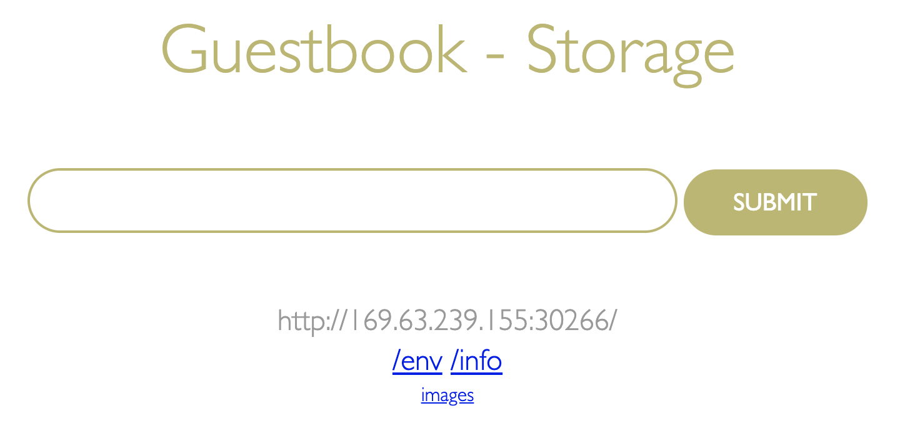
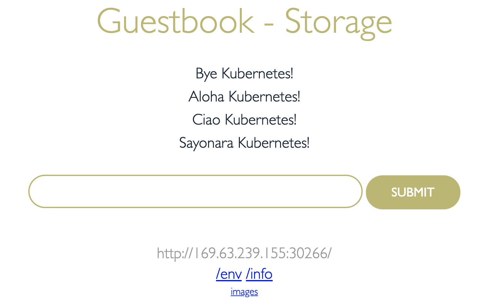

# Lab 1. Non-pesistent storage with Kubernetes

Storing data in containers or worker nodes are considered as the [non-persistent](https://kubernetes.io/docs/concepts/configuration/manage-resources-containers/#local-ephemeral-storage) forms of data storage.
In this lab, we will explore storage options on the IBM Kubernetes worker nodes. Follow this [lab](https://github.com/remkohdev/docker101/tree/master/workshop/lab-3) is you are interested in learning more about container based storage.

The lab covers the following topics:
- Create and claim persistent volumes based on the [primary]() and secondary storage available on the worker nodes.
- Make the volumes available in the `Guestbook` application.
- Use the volumes to stroage application cache and debug information.
- Access the data from the guestbook container using the Kubernetes CLI.
- Claim back the storage resources and clean up.


The primary storage maps to the volume type `hostPath` and the secondary storage maps to `emptyDir`. Learn more about Kubernetes volume types [here](https://kubernetes.io/docs/concepts/storage/volumes/).

## Reserve Persistent Volumes

From the cloud shell prompt, run the following commands to get the guestbook application and the kubernetes configuration needed for the storage labs.

```bash
cd $HOME
git clone --branch fs https://github.com/IBM/guestbook-nodejs.git
git clone --branch storage https://github.com/rojanjose/guestbook-config.git
cd $HOME/guestbook-config/storage
```

Let's start with reserving the Persistent volume from the primary storage.
Review the yaml file `pv-hostpath.yaml`. Note the values set for `type`, `storageClassName` and `hostPath`.

```console
apiVersion: v1
kind: PersistentVolume
metadata:
  name: guestbook-primary-pv
  labels:
    type: local
spec:
  storageClassName: manual
  capacity:
    storage: 10Gi
  accessModes:
    - ReadWriteOnce
  hostPath:
    path: "/mnt/data"
```

Create the persistent volume as shown in the comamand below.
```
kubectl create -f pv-hostpath.yaml
persistentvolume/guestbook-primary-pv created

kubectl get pv
NAME                                       CAPACITY   ACCESS MODES   RECLAIM POLICY   STATUS      CLAIM                   STORAGECLASS       REASON   AGE
guestbook-primary-pv                       10Gi       RWO            Retain           Available                           manual                      13s
```

Next 
PVC yaml:
```
apiVersion: v1
kind: PersistentVolumeClaim
metadata:
 name: guestbook-local-pvc
spec:
  storageClassName: manual
  accessModes:
    - ReadWriteMany
  resources:
    requests:
      storage: 3Gi
```

Create PVC:

```
kubectl create -f guestbook-local-pvc.yaml
persistentvolumeclaim/guestbook-local-pvc created
❯ kubectl get pvc
NAME                  STATUS   VOLUME                                     CAPACITY   ACCESS MODES   STORAGECLASS       AGE
guestbook-local-pvc   Bound    guestbook-local-pv                         10Gi       RWX            manual             6s
```


## Guestbook application using storage

The application is the [Guestbook App](https://github.com/IBM/guestbook-nodejs), which is a simple multi-tier web application built using the loopback framework.

Change to the guestbook application source directory:

```
cd $HOME/guestbook-nodejs/src
```
Review the source `common/models/entry.js`. The application uses storage allocated using `hostPath` to store data cache in the file `data/cache.txt`. The file `logs/debug.txt` records debug messages and is provisioned via the `emptyDir` storage type.

```source
module.exports = function(Entry) {

    Entry.greet = function(msg, cb) {

        // console.log("testing " + msg);
        fs.appendFile('logs/debug.txt', "Recevied message: "+ msg +"\n", function (err) {
            if (err) throw err;
            console.log('Debug stagement printed');
        });

        fs.appendFile('data/cache.txt', msg+"\n", function (err) {
            if (err) throw err;
            console.log('Saved in cache!');
        });

...
```

Run the commands listed below to build the guestbook image and copy into docker hub registry:

```
cd $HOME/guestbook-nodejs/src
docker build -t $DOCKERUSER/guestbook-nodejs:storage .
export DOCKERUSER=rojanjose
docker login -u DOCKERUSER
docker push $DOCKERUSER/guestbook-nodejs:storage
```

Review the deployment yaml file `guestbook-deplopyment.yaml` prior to deploying the application into the cluster.

```
cd $HOME/storage/lab1
cat guestbook-deplopyment.yaml
```

The section `spec.volumes` lists `hostPath` and `emptyDir` volumes. The section `spec.containers.volumeMounts` lists the mount paths that the application uses to write in the volumes.

```
apiVersion: apps/v1
kind: Deployment
metadata:
  name: guestbook-v1
  labels:
    app: guestbook
 ...
    spec:
      containers:
        - name: guestbook
          image: rojanjose/guestbook-nodejs:storage
          imagePullPolicy: Always
          ports:
          - name: http-server
            containerPort: 3000
          volumeMounts:
          - name: guestbook-primary-volume
            mountPath: /home/node/app/data
          - name: guestbook-secondary-volume
            mountPath: /home/node/app/logs
      volumes:
      - name: guestbook-primary-volume
        persistentVolumeClaim:
          claimName: guestbook-primary-pvc
      - name: guestbook-secondary-volume
        emptyDir: {}
  

...
```

Deploy Guestbook application:

```
kubectl create -f guestbook-deployment.yaml
deployment.apps/guestbook-v1 created

kubectl get pods
NAME                            READY   STATUS    RESTARTS   AGE
guestbook-v1-6f55cb54c5-jb89d   1/1     Running   0          14s

kubectl create -f guestbook-service.yaml
service/guestbook created
```

Find the URL for the guestbook application by joining the worker node external IP and service node port.

```
HOSTNAME=`ibmcloud ks workers --cluster $CLUSTERNAME | grep Ready | head -n 1 | awk '{print $2}'`
SERVICEPORT=`kubectl get svc guestbook -o=jsonpath='{.spec.ports[0].nodePort}'`
echo "http://$HOSTNAME:$SERVICEPORT"
```

Open the URL in a browser and create guest book entries.


Log into the pod:

```
kubectl exec -it guestbook-v1-6f55cb54c5-jb89d bash

kubectl exec [POD] [COMMAND] is DEPRECATED and will be removed in a future version. Use kubectl kubectl exec [POD] -- [COMMAND] instead.

root@guestbook-v1-6f55cb54c5-jb89d:/home/node/app# ls -al
total 256
drwxr-xr-x   1 root root   4096 Nov 11 23:40 .
drwxr-xr-x   1 node node   4096 Nov 11 23:20 ..
-rw-r--r--   1 root root     12 Oct 29 21:00 .dockerignore
-rw-r--r--   1 root root    288 Oct 29 21:00 .editorconfig
-rw-r--r--   1 root root      8 Oct 29 21:00 .eslintignore
-rw-r--r--   1 root root     27 Oct 29 21:00 .eslintrc
-rw-r--r--   1 root root    151 Oct 29 21:00 .gitignore
-rw-r--r--   1 root root     30 Oct 29 21:00 .yo-rc.json
-rw-r--r--   1 root root    105 Oct 29 21:00 Dockerfile
drwxr-xr-x   2 root root   4096 Nov 11 03:40 client
drwxr-xr-x   3 root root   4096 Nov 10 23:04 common
drwxr-xr-x   2 root root   4096 Nov 11 23:16 data
drwxrwxrwx   2 root root   4096 Nov 11 23:44 logs
drwxr-xr-x 439 root root  16384 Nov 11 23:20 node_modules
-rw-r--r--   1 root root 176643 Nov 11 23:20 package-lock.json
-rw-r--r--   1 root root    830 Nov 11 23:20 package.json
drwxr-xr-x   3 root root   4096 Nov 10 23:04 server

root@guestbook-v1-6f55cb54c5-jb89d:/home/node/app# cat data/cache.txt
Hello Kubernetes!
Hola Kubernetes!
Zdravstvuyte Kubernetes!
Nǐn hǎo Kubernetes!
Goedendag Kubernetes!

root@guestbook-v1-6f55cb54c5-jb89d:/home/node/app# cat logs/debug.txt
Recevied message: Hello Kubernetes!
Recevied message: Hola Kubernetes!
Recevied message: Zdravstvuyte Kubernetes!
Recevied message: Nǐn hǎo Kubernetes!
Recevied message: Goedendag Kubernetes!


root@guestbook-v1-6f55cb54c5-jb89d:/home/node/app# df -h
Filesystem               Size  Used Avail Use% Mounted on
overlay                   98G  3.5G   90G   4% /
tmpfs                     64M     0   64M   0% /dev
tmpfs                    7.9G     0  7.9G   0% /sys/fs/cgroup
/dev/mapper/docker_data   98G  3.5G   90G   4% /etc/hosts
shm                       64M     0   64M   0% /dev/shm
/dev/xvda2                25G  3.6G   20G  16% /home/node/app/data
tmpfs                    7.9G   16K  7.9G   1% /run/secrets/kubernetes.io/serviceaccount
tmpfs                    7.9G     0  7.9G   0% /proc/acpi
tmpfs                    7.9G     0  7.9G   0% /proc/scsi
tmpfs                    7.9G     0  7.9G   0% /sys/firmware

```

Kill the pod to see the impact of deleting the pod on data.

```
kubectl get pods
NAME                            READY   STATUS    RESTARTS   AGE
guestbook-v1-6f55cb54c5-jb89d   1/1     Running   0          12m

kubectl delete pod guestbook-v1-6f55cb54c5-jb89d
pod "guestbook-v1-6f55cb54c5-jb89d" deleted

kubectl get pods
NAME                            READY   STATUS    RESTARTS   AGE
guestbook-v1-5cbc445dc9-sx58j   1/1     Running   0          86s
```



Enter new data:


Log into the pod to view the state of the data.

```
kubectl get pods
NAME                            READY   STATUS    RESTARTS   AGE
guestbook-v1-5cbc445dc9-sx58j   1/1     Running   0          86s

kubectl exec -it guestbook-v1-5cbc445dc9-sx58j bash
kubectl exec [POD] [COMMAND] is DEPRECATED and will be removed in a future version. Use kubectl kubectl exec [POD] -- [COMMAND] instead.

root@guestbook-v1-5cbc445dc9-sx58j:/home/node/app# cat data/cache.txt
Hello Kubernetes!
Hola Kubernetes!
Zdravstvuyte Kubernetes!
Nǐn hǎo Kubernetes!
Goedendag Kubernetes!
Bye Kubernetes!
Aloha Kubernetes!
Ciao Kubernetes!
Sayonara Kubernetes!

root@guestbook-v1-5cbc445dc9-sx58j:/home/node/app# cat logs/debug.txt
Recevied message: Bye Kubernetes!
Recevied message: Aloha Kubernetes!
Recevied message: Ciao Kubernetes!
Recevied message: Sayonara Kubernetes!
root@guestbook-v1-5cbc445dc9-sx58j:/home/node/app#
```

This shows that the storage type `emptyDir` loose data on a pod restart where as `hostPath` data lives until the worker node or cluster is deleted.


## Clean up

```
cd $HOME/guestbook-config/storage/lab1
kubectl delete -f .
```