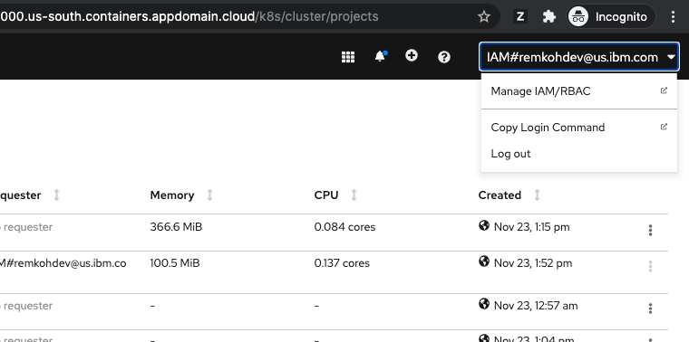
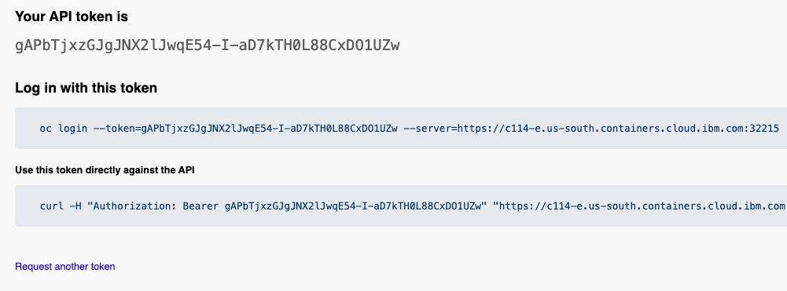

# Configure your Cluster

You now have an Object Storage instance with a bucket, and have found the corresponding private endpoint for your Object Storage. Next, we can configure a Kubernetes cluster:
1. Create a New Namespace in your Cluster,
2. Create a Secret to Access the Object Storage,

## Create a New Namespace in your Cluster

1. Previously, you logged in to your personal account to create a free instance of IBM Cloud Object Storage (COS). If the cluster exists in a different account, make sure to to switch accounts and log in to the IBM Cloud where your cluster exists.

    ```
    ibmcloud login -u $IBM_ID
    ```

    **Note:** if you use a single-sign-on provider, use the `-sso` flag.

2. If you needed to switch accounts, you will have logged in again, and when prompted to `Select an account`, this time, choose the account with your cluster. In the example below, I have to choose account number **2** from the list, `2. IBM Client Developer Advocacy (e65910fa61) <-> 1234567`,

    ```
    ibmcloud login -u b.newell2@remkoh.dev
    API endpoint: https://cloud.ibm.com
    Region: us-south

    Password> 
    Authenticating...
    OK

    Select an account:
    1. B Newell's Account (31296e3a285)
    2. IBM Client Developer Advocacy (e65910fa61) <-> 1234567
    Enter a number> **2**
    Targeted account IBM Client Developer Advocacy (e65910fa61) <-> 1234567
    ```

3. Retrieve your cluster information.

    ```
    ibmcloud ks clusters
    ```

    outputs, 

    ```
    $ ibmcloud ks clusters

    Name    ID    State    Created    Workers    Location    Version    Resource Group Name    Provider
    <yourcluster>    br78vuhd069a00er8s9g    normal    1 day ago      1    Dallas    1.16.10_1533    default    classic
    ```

4. Retrieve the name of your cluster, in this example, I set the name of the first cluster with index `0`,

    ```
    CLUSTER_NAME=$(ibmcloud ks clusters --output json | jq -r '.[0].name')
    echo $CLUSTER_NAME
    ```

5.  **In your browser:** get the login command for your cluster: 
    1.  Go to the IBM Cloud resources page at https://cloud.ibm.com/resources,
    Under `Clusters` find and select your cluster, and load the cluster overview page. There are two ways to retrieve the login command with token:
    1. Click the `Actions` drop down next to the `OpenShift web console` button, and select `Connect via CLI`, in the pop-up window, click the `oauth token request page` link, or
    2. Click `OpenShift web console` button, in the `OpenShift web console`, click your profile name, such as IAM#name@email.com, and then click `Copy Login Command`. 

    

    In the new page that opens for both options, click `Display Token`, 
    
    
    
    Copy the `oc login` command, 
    
    
    
    and paste the command into your terminal.

    ```
    $ oc login --token=HjXc6nNGyCB1imhqtc9csTmGQ5obrPcoe4SRJqTnnT8 --server=https://c100-e.us-south.containers.cloud.ibm.com:30712
    Logged into "https://c100-e.us-south.containers.cloud.ibm.com:30712" as "IAM#b.newell2@remkoh.dev" using the token provided.

    You have one project on this server: "<your-project>"

    Using project "<your-project>".
    Welcome! See 'oc help' to get started.
    ```

6.  Create a new project `cos-with-s3fs`

    ```
    oc new-project $NAMESPACE
    ```

7.  Make sure you're still logged in to your cluster and namespace,

    ```
    oc project
    
    Using project "cos-with-s3fs"
    ```

## Create a Secret to Access the Object Storage

1. Create a `Kubernetes Secret` to store the COS service credentials named `cos-write-access`.

    ```
    oc create secret generic cos-write-access --type=ibm/ibmc-s3fs --from-literal=api-key=$COS_APIKEY --from-literal=service-instance-id=$COS_GUID
    ```

    outputs,

    ```
    $ oc create secret generic cos-write-access --type=ibm/ibmc-s3fs --from-literal=api-key=$COS_APIKEY --from-literal=service-instance-id=$COS_GUID

    secret/cos-write-access created
    ```

## Next

[Setup the Cloud Object Storage plugin](COS-PLUGIN.md)