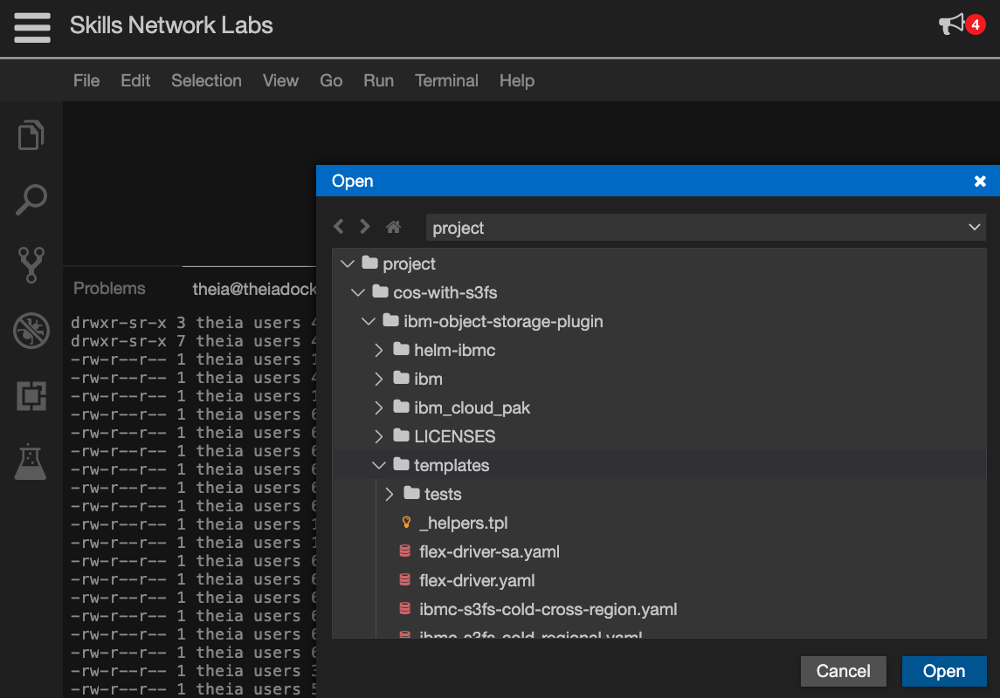

# Setup the IBM Cloud Object Storage Plugin

You are going to install the `IBM Cloud Object Storage Plugin` in your cluster, using the Helm CLI tool in this section.

1. Add a Helm repository where `IBM Cloud Object Storage Plugin` chart resides.

    ```console
    helm repo add ibm-charts https://icr.io/helm/ibm-charts
    ```

    outputs,

    ```console
    $ helm repo add ibm-charts https://icr.io/helm/ibm-charts

    `ibm-charts` has been added to your repositories
    ```

1. Refresh your local Helm repository.

    ```console
    helm repo update
    ```

    outputs,

    ```console
    $ helm repo update

    Hang tight while we grab the latest from your chart repositories...
    ...Successfully got an update from the "ibm-charts" chart repository
    Update Complete. ⎈ Happy Helming!⎈
    ```

1. Download and unzip the `IBM Cloud Object Storage` plugin to your client, then install the plugin to your cluster from local client.

    ```console
    helm pull --untar ibm-charts/ibm-object-storage-plugin
    ls -al
    helm plugin install ./ibm-object-storage-plugin/helm-ibmc
    ```

    should result in,

    ```console
    $ helm plugin install ./ibm-object-storage-plugin/helm-ibmc

    Installed plugin: ibmc
    ```

1. Housekeeping to allow execution of the `ibmc.sh` script by making the file executable.

    ```console
    chmod 755 $HOME/.local/share/helm/plugins/helm-ibmc/ibmc.sh
    ```

1. Verify the `IBM Cloud Object Storage plugin` installation. The plugin usage information should be displayed when running the command below.

    ```console
    helm ibmc --help
    ```

1. Before using the `IBM Cloud Object Storage Plugin`, configuration changes are required.
1. In the `Cloud Shell` where you downloaded the IBM Cloud Object Storage plugin, navigate to the `/project/cos-with-s3fs/ibm-object-storage-plugin/templates` folder of the `IBM Cloud Object Storage Plugin` installation.

    ```console
    ls -al ibm-object-storage-plugin/templates
    ```

1. Make sure the `provisioner-sa.yaml` file is present and configure it to access the COS service using the COS service credentials secret `cos-write-access` that you created in the previous section.

1. In the Theia editor, click `File` > `Open`, and browse to the `/project/cos-with-s3fs/ibm-object-storage-plugin/templates` directory and open the file `provisioner-sa.yaml`.

    

1. Search for content `ibmcloud-object-storage-secret-reader` in the file around line 62.

    **in a `vi` editor**,
    - Type colon `:`
    - Type `/ibmcloud-object-storage-secret-reader`
    - Press `<ENTER>` key

1. Scroll a few lines down to line #72 and find the section that is commented out `#resourceNames: [""]`.

    ```console
    rules:
    - apiGroups: [""]
        resources: ["secrets"]
        #resourceNames: [""]
    ```

1. Uncomment the line and change the section to set the secret to `cos-write-access` and allow access to the COS instance,

    ```console
    rules:
    - apiGroups: [""]
        resources: ["secrets"]
        resourceNames: ["cos-write-access"]
    ```

1. Save the change and close the file.
1. Install the configured storage classes for `IBM Cloud Object Storage`, which will use the edited template file.

    ```console
    helm ibmc install ibm-object-storage-plugin ./ibm-object-storage-plugin
    ```

    outputs,

    ```console
    $ helm ibmc install ibm-object-storage-plugin ./ibm-object-storage-plugin

    Helm version: v3.2.0+ge11b7ce
    Installing the Helm chart...
    PROVIDER: CLASSIC
    DC: hou02
    Chart: ./ibm-object-storage-plugin
    NAME: ibm-object-storage-plugin
    LAST DEPLOYED: Sat May 23 17:45:25 2020
    NAMESPACE: default
    STATUS: deployed
    REVISION: 1
    NOTES:
    Thank you for installing: ibm-object-storage-plugin.   Your release is named: ibm-object-storage-plugin
    ....
    <and a whole lot more instructions>
    ```

1. Verify that the storage classes are created successfully.

    ```console
    oc get storageclass | grep 'ibmc-s3fs'
    ```

    outputs,

    ```console
    $ oc get storageclass | grep 'ibmc-s3fs'

    ibmc-s3fs-cold-cross-region    ibm.io/ibmc-s3fs    19s
    ibmc-s3fs-cold-regional    ibm.io/ibmc-s3fs   19s
    ibmc-s3fs-flex-cross-region    ibm.io/ibmc-s3fs   19s
    ibmc-s3fs-flex-perf-cross-region    ibm.io/ibmc-s3fs   19s
    ibmc-s3fs-flex-perf-regional    ibm.io/ibmc-s3fs   19s
    ibmc-s3fs-flex-regional    ibm.io/ibmc-s3fs   19s
    ibmc-s3fs-standard-cross-region    ibm.io/ibmc-s3fs   19s
    ibmc-s3fs-standard-perf-cross-region    ibm.io/ibmc-s3fs   19s
    ibmc-s3fs-standard-perf-regional    ibm.io/ibmc-s3fs   19s
    ibmc-s3fs-standard-regional    ibm.io/ibmc-s3fs   19s
    ibmc-s3fs-vault-cross-region    ibm.io/ibmc-s3fs   19s
    ibmc-s3fs-vault-regional    ibm.io/ibmc-s3fs   19s
    ```

1. Review the storage class `ibmc-s3fs-standard-regional`.

    ```console
    oc describe storageclass ibmc-s3fs-standard-regional
    ```

    outputs,

    ```console
    $ oc describe storageclass ibmc-s3fs-standard-regional

    Name:                  ibmc-s3fs-standard-regional
    IsDefaultClass:        No
    Annotations:           meta.helm.sh/release-name=ibm-object-storage-plugin,meta.helm.sh/release-namespace=default
    Provisioner:           ibm.io/ibmc-s3fs
    Parameters:            ibm.io/chunk-size-mb=16,ibm.io/curl-debug=false,ibm.io/debug-level=warn,ibm.io/iam-endpoint=https://iam.bluemix.net,ibm.io/kernel-cache=true,ibm.io/multireq-max=20,ibm.io/object-store-endpoint=NA,ibm.io/object-store-storage-class=NA,ibm.io/parallel-count=2,ibm.io/s3fs-fuse-retry-count=5,ibm.io/stat-cache-size=100000,ibm.io/tls-cipher-suite=AESGCM
    AllowVolumeExpansion:  <unset>
    MountOptions:          <none>
    ReclaimPolicy:         Delete
    VolumeBindingMode:     Immediate
    Events:                <none>
    ```

    Additional information is available at [https://cloud.ibm.com/docs/containers?topic=containers-object_storage#configure_cos](https://cloud.ibm.com/docs/containers?topic=containers-object_storage#configure_cos).

1. Verify that plugin pods are in "Running" state and indicate `READY` state of `1/1`:

    ```console
    oc get pods -n kube-system -o wide | grep object
    ```

    outputs,

    ```console
    $ oc get pods -n kube-system -o wide | grep object

    ibmcloud-object-storage-driver-p4ljp             0/1     Running   0          32s     10.169.231.148   10.169.231.148   <none>           <none>
    ibmcloud-object-storage-driver-zqb4h             0/1     Running   0          32s     10.169.231.153   10.169.231.153   <none>           <none>
    ibmcloud-object-storage-plugin-fbb867887-msqcg   0/1     Running   0          32s     172.30.136.24    10.169.231.153   <none>           <none>
    ```

    If the pods are not `READY` and indicate `0/1` then wait and re-run the command until the `READY` state says `1/1`.

    The installation is successful when one `ibmcloud-object-storage-plugin` pod and one or more `ibmcloud-object-storage-driver` pods are in `running` state.

    The number of `ibmcloud-object-storage-driver` pods equals the number of worker nodes in your cluster. All pods must be in a `Running` state for the plug-in to function properly. If the pods fail, run `kubectl describe pod -n kube-system <pod_name>` to find the root cause for the failure.

## Next

[Create the PersistentVolumeClaim](PVC.md)
