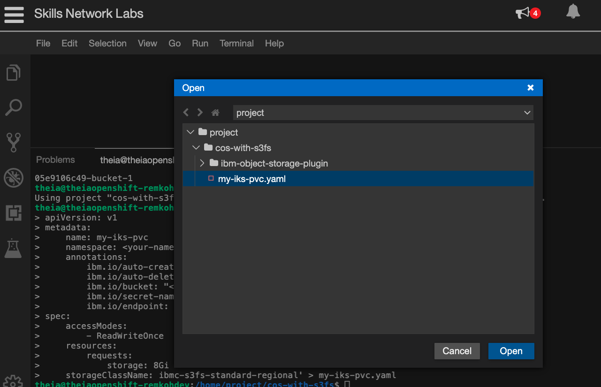

# Create the PersistentVolumeClaim

Depending on the settings that you choose in your PVC, you can provision IBM Cloud Object Storage in the following ways:

- [Dynamic provisioning](https://cloud.ibm.com/docs/containers?topic=containers-kube_concepts#dynamic_provisioning): When you create the PVC, the matching persistent volume (PV) and the bucket in your IBM Cloud Object Storage service instance are automatically created.
- [Static provisioning](https://cloud.ibm.com/docs/containers?topic=containers-kube_concepts#static_provisioning): You can reference an existing bucket in your IBM Cloud Object Storage service instance in your PVC. When you create the PVC, only the matching PV is automatically created and linked to your existing bucket in IBM Cloud Object Storage.

In this exercise, you are going to use an existing bucket when assigning persistant storage to IKS container.

1. In the cloud shell connected to your cluster, create a `PersistentVolumeClaim` configuration file.

    > Note: Replace the values for:
      - `ibm.io/bucket`, 
      - `ibm.io/secret-name` and 
      - `ibm.io/endpoint`.
      
      If your values are not exactly matching with the bucket name you created, the secret name you created and the private endpoint of your bucket, the PVC will remain in state pending and fail to create.

    > Note: The `secret-name` should be set to `cos-write-access` unless you changed the name of the secret we created earlier,

    > Note: `ibm.io/endpoint` should be set to the output of command `echo "https://$COS_PRIVATE_ENDPOINT"` 

    > Create the file first and then edit the file with `vi` if changes are needed,

1. You need the bucket name and namespace to configure the PVC,

    ```
    echo "https://$COS_PRIVATE_ENDPOINT"
    echo $COS_BUCKET_NAME
    oc project
    ```

1. Create the file,

```
echo 'kind: PersistentVolumeClaim
apiVersion: v1
metadata:
    name: my-iks-pvc
    namespace: <your-namespace>
    annotations:
        ibm.io/auto-create-bucket: "false"
        ibm.io/auto-delete-bucket: "false"
        ibm.io/bucket: "<your-cos-bucket>"
        ibm.io/secret-name: "cos-write-access"
        ibm.io/endpoint: "https://s3.private.us-south.cloud-object-storage.appdomain.cloud"
spec:
    accessModes:
        - ReadWriteOnce
    resources:
        requests:
            storage: 8Gi
    storageClassName: ibmc-s3fs-standard-regional' > my-iks-pvc.yaml
```

**Note**: indentation in YAML is important. If the PVC status remains `Pending`, the two usual suspects will be the `secret` with its credentials and the indentation in the YAML of the PVC.

1. In `Theia` the integrated browser IDE, in the directory `/project/cos-with-s3fs`, open the file `my-iks-pvc.yaml`, 

    

and set the right values if changes are still needed, 
    
    * change the `namespace` value to the project name found with `oc project`,
    * the `ibm.io/bucket` should be set to the value defined in `echo $COS_BUCKET_NAME`,
    * `ibm.io/secret-name` should be set to `"cos-write-access"`,
    * validate the `ibm.io/endpoint` to be set to the private service endpoint for your Object Storage bucket for the correct region,

1. Create a `PersistentVolumeClaim`.

    ```
    oc apply -f my-iks-pvc.yaml
    ```

    outputs,

    ```
    $ oc apply -f my-iks-pvc.yaml

    persistentvolumeclaim/my-iks-pvc created
    ```

2. Verify the `PersistentVolumeClaim` and through the PVC also the `PersistentVolume` or PV was created successfully and that the PVC has `STATUS` of `Bound`.

    ```
    oc get pvc
    ```

    should output a status of `Bound`,

    ```
    $ oc get pvc

    NAME         STATUS   VOLUME                                     CAPACITY   ACCESS MODES   STORAGECLASS                  AGE
    my-iks-pvc   Bound    pvc-1a1f4bce-a8fe-4bd8-a160-f9268af2d18a   8Gi        RWO            ibmc-s3fs-standard-regional   4s
    ```

    > Note: If the state of the PVC remains `Pending`, you can inspect the error for why the PVC remains pending by using the `describe` command: `oc describe pvc <pvc_name>`. For example, `oc describe pvc my-iks-pvc`.

    > Note: If the state of the PVC stays as `Pending`, the problem must be resolved before you move to the next step.

3. Verify a new `PersistentVolume` was also created successfully.

    ```
    oc get pv
    ```

    outputs,

    ```
    $ oc get pv

    NAME    CAPACITY    ACCESS MODES    RECLAIM POLICY    STATUS   CLAIM    STORAGECLASS    REASON    AGE
    pvc-70ac9454-27d8-43db-807f-d75474b0d61c    100Gi    RWX    Delete    Bound    openshift-image-registry/image-registry-storage    ibmc-file-gold     36h
    pvc-86d739c4-86c1-4496-ab4e-c077d947acc0   8Gi    RWO    Delete    Bound    remkohdev-project1/my-iks-pvc    ibmc-s3fs-standard-regional    4m26s
    ```

You're now ready to persist data on the IBM Cloud Object Storage within your containers in your cluster.

## Next

[MongoDB](MONGODB.md)