# Setup

This section is broken up into the following steps:

- [Setup](#setup)
  - [1. Sign up for IBM Cloud](#1-sign-up-for-ibm-cloud)
  - [2. Setup Client CLI](#2-setup-client-cli)
  - [3. Access to an OpenShift Cluster](#3-access-to-an-openshift-cluster)
  - [4. Environment Variables](#4-environment-variables)
  - [Next](#next)

## 1. Sign up for IBM Cloud

If you have an IBM Cloud account already, you can skip this step and login to your account now at [IBM Cloud](https://cloud.ibm.com). To create a new account, follow the steps below,

1. Open a web browser and go to the [IBM Cloud Sign up page - https://ibm.biz/BdqbEh](https://ibm.biz/BdqbEh)

   

1. In the `Create an account` window, enter your company email id and the password you would like to use. Click the **`Next`** button.

    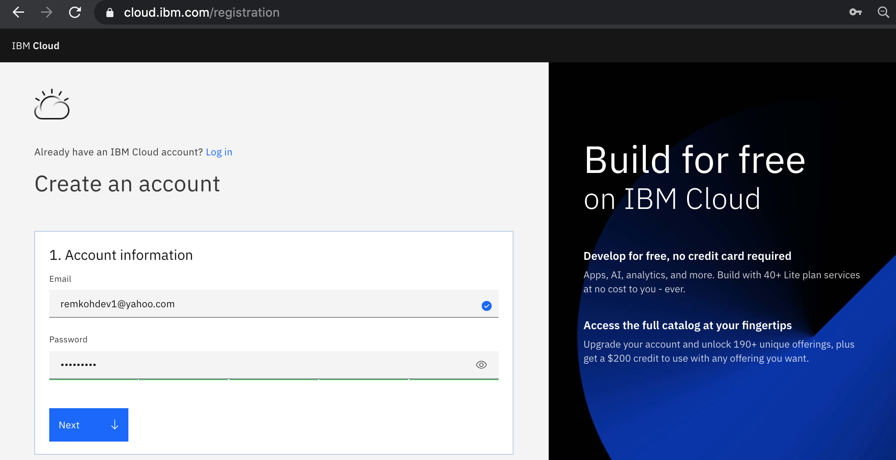

1. The `Verify email` section will inform you that a verification code was sent to your email.

    

1. Switch to your email provider to retrieve the verification code. Then enter the verification code in the `Verify email` section, and click the **`Next`** button.

    

1. Enter your first name, last name and country in the `Personal information` section and click the **`Next`** button.

    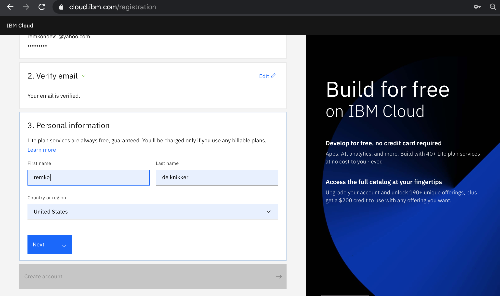

1. Click the **`Create account`** button.

    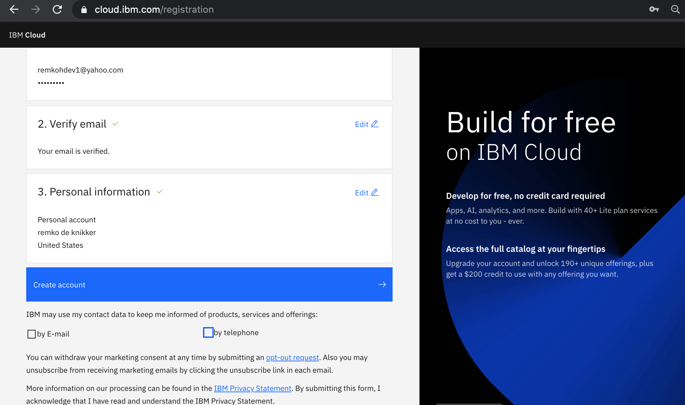

1. After your account is created, review the `IBM Privacy Statement`. Then scroll down and click the **`Proceed`** button to acknowledge the privacy statement.

    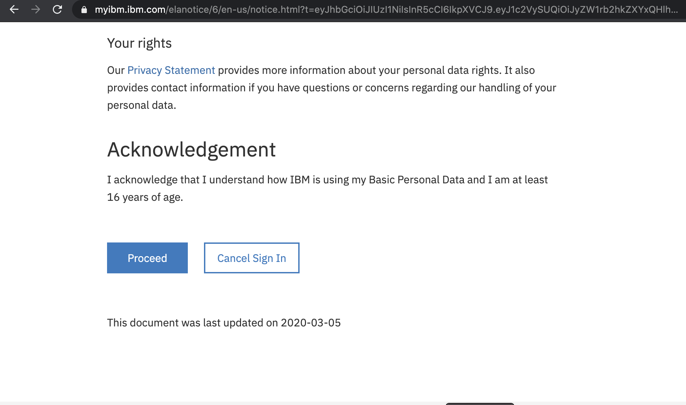

1. You are now ready to login to the IBM Cloud. Open a web browser to the [IBM Cloud console](https://cloud.ibm.com). If prompted, enter your IBM Id (the email ID you used to create the account above) followed by your password to login.

    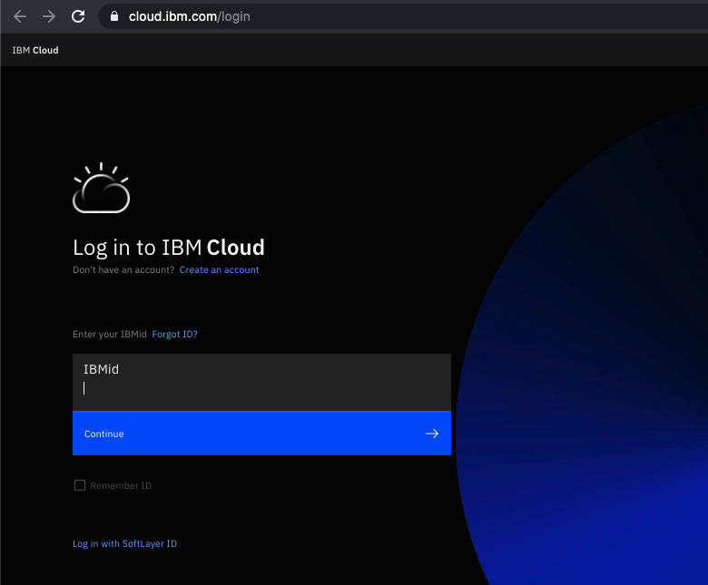

1. The IBM Cloud dashboard page should load.

    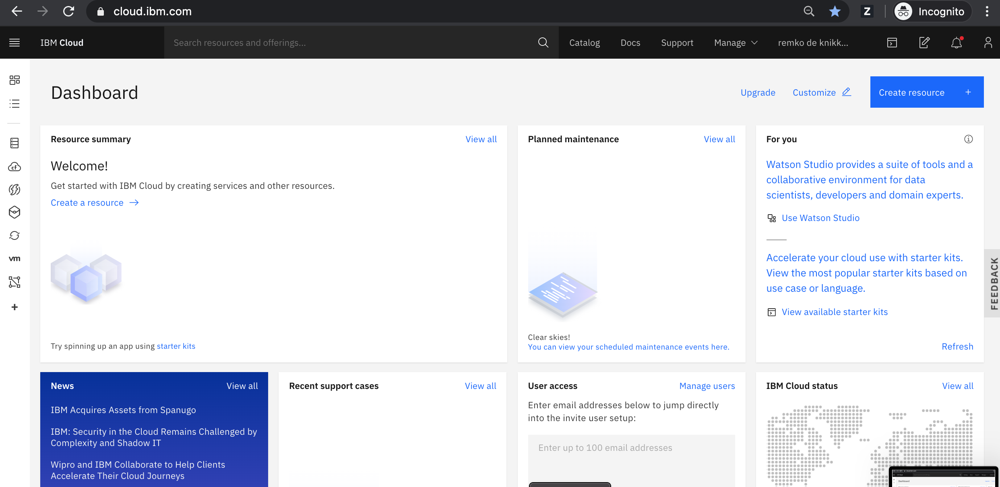

1. You have successfully registered a new IBM Cloud account.

## 2. Setup Client CLI

1. If you have already registered your account, you can access the lab environment at [**https://labs.cognitiveclass.ai/**](https://labs.cognitiveclass.ai/) and login.

1. Navigate to [https://labs.cognitiveclass.ai/register](https://labs.cognitiveclass.ai/register),

    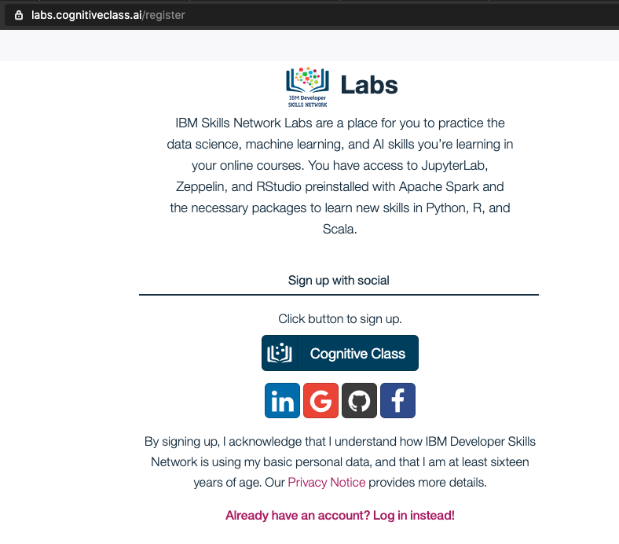

1. Create a new account with your existing `IBM Id.`

    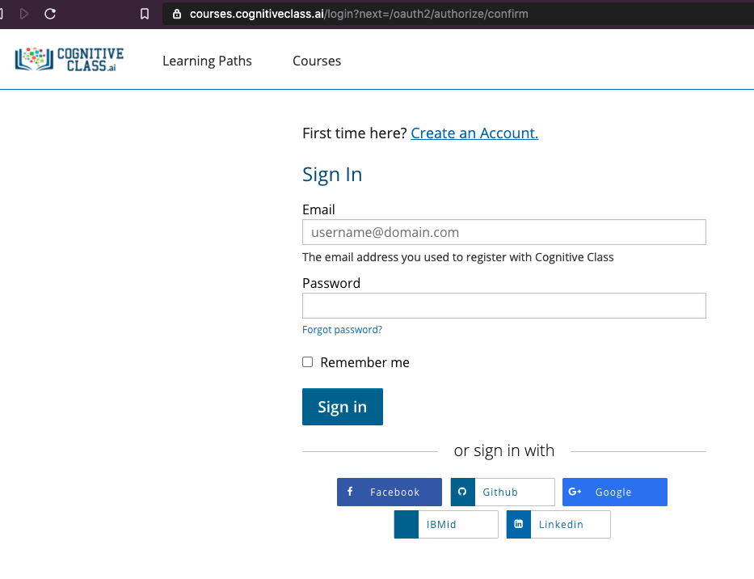

1. Alternative, you can choose to use a Social login (LinkedIn, Google, Github or Facebook), or for using your email account click the `Cognitive Class` button,

1. Click `Create an Account`,

1. Fill in your Email, Full Name, Public Username and password, click on the check boxes next to the `Privacy Notice` and `Terms of Service` to accept them. Then click on `Create Account`.

1. You will then be taken to a page with a list of sandbox environments. Click on the option for **Theia - Cloud IDE (With OpenShift)**

    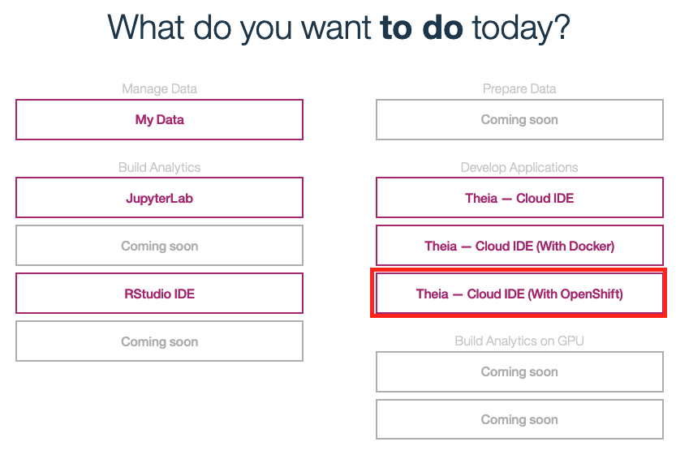

1. Wait a few minutes while your environment is created.

    

1. You will be taken to a blank editor page once your environment is ready.

1. What we really need is access to the terminal. Click on the `Terminal` tab near the top of the page and select **New Terminal**

    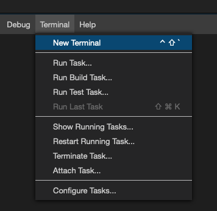

1. You can then click and drag the top of the terminal section upwards to make the terminal section bigger.

    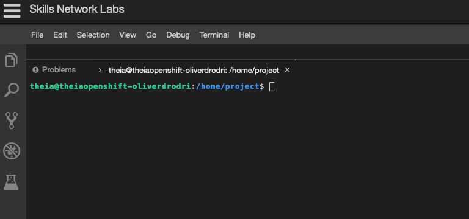

## 3. Access to an OpenShift Cluster

To connect to a `RedHat OpenShift Kubernetes Service (ROKS)` instance, see the instructions [here](https://ibm.github.io/workshop-setup/ROKS/).

## 4. Environment Variables

Create an environment variable for your IBM ID,

```console
IBM_ID=<your ibm id>
```

If completed, in your [terminal](https://labs.cognitiveclass.ai/), create a working directory named `cos-with-s3fs` to start the lab,

```console
NAMESPACE=cos-with-s3fs
mkdir $NAMESPACE
cd $NAMESPACE
export WORKDIR=$(pwd)
echo $WORKDIR
```

should output the directory `/home/project/cos-with-s3fs`.

## Next

[Setup Object Storage](../cos-with-s3fs/COS.md)